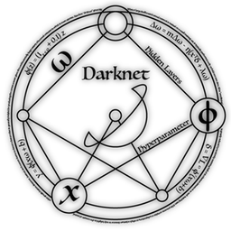

# php-darknet
[]
[](https://packagist.org/packages/ghostjat/darknet)
[](https://scrutinizer-ci.com/g/ghostjat/php-darknet/build-status/main)
[](https://scrutinizer-ci.com/code-intelligence)



php-ffi experiment
=========
php interface to the lib-darknet for object detection.
Php7.4+ is required

Install
---------
composer require ghostjat/darknet

Description
-----------
[lib-darknet](https://github.com/pjreddie/darknet) 

# Darknet #
Darknet is an open source neural network framework written in C and CUDA. It is fast, easy to install, and supports CPU and GPU computation.

* It offers a simple API.
* High performance, due to the fact that it uses native interface elements.
* Fast learning by the user, due to the simplicity of its API.
# yolo v2, v3, v4 #

If running on cpu you may use FASTEST cfg & weight for real time object detection on MS COCO dataset.
```php

require '../vendor/autoload.php';

use darknet\core;
$dn = new core(core::YOLOFASTEST);
```
System-Conf:- 
    CPU:- Intel(R) Core(TM) i3-2370M CPU @ 2.40GHz 64bit
    MEM:- 8GB
    Dataset:- MS-COCO Classes:- 80
   
|  YOLO     |   Time (ms)     |   CPU     | Mem(mb)(max)  |
|-----------|-----------------|-----------|---------------|
| Tiny-v2   | 0.85933095 (max)|   78      |     143.59    |
|           | 0.62237596 (min)|           |               |
| Tiny-v3   | 0.93895602 (max)|   90      |     125.9     |
|           | 0.60306811 (min)|           |               |
| Main-v3   | **15.4672219 (max)**|   98  |     964.5     |
|           | 14.0677847 (min)|           |               |
| Tiny-v4   | 0.85933095 (max)|   82      |     151.9     |
|           | 0.62237596 (min)|           |               |
| FASTEST   | 0.20039399 (max)|   20      |     97.47     |
|           | **0.11836814 (min)**|       |               |
| FASTEST-xl| 0.80017591 (max)|   69      |     131.85    |
|           | 0.22637511 (min)|           |               |

Synopsis
--------
WARNING:  
This module is in its early stages and should be considered a Work in Progress.
The interface is not final and may change in the future.  

Sample:

<p align="center">


</p>

Sample code:

```php

require '../vendor/autoload.php';

use darknet\core;
$lib = '/home/ghost/bin/c-lib/darknet/data/';
$img = ['eagle.jpg','giraffe.jpg','horses.jpg','person.jpg','kite.jpg'];
$dn = new core();
foreach ($img as $value) {
    $dn->detect($lib.$value);
}
```
Author
------
Shubham Chaudhary <ghost.jat@gmail.com>
